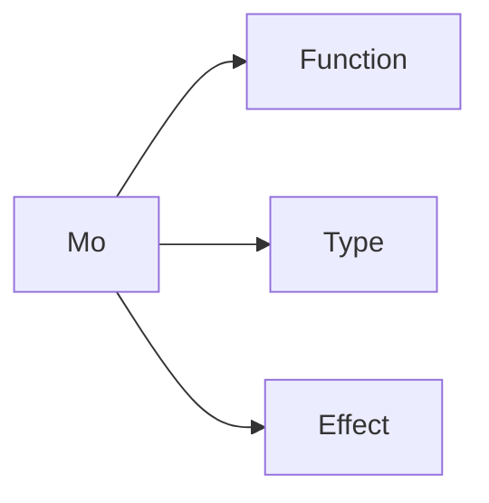

# Language Design

**Mo** (墨) is functional, general-purpose, compiled programming language that compiles to LLVM IR and WASM.

**Mo** aims to be a simple to learn programming language. If you are familiar with JavaScript, you should be able to pick up **Mo** in a few hours.

The **Mo** language is heavily inspired by:

- [TypeScript](https://www.typescriptlang.org/)
  - Syntax and semantics
- [Rust](https://www.rust-lang.org/)
  - Traits
  - Borrow checker
- [Koka](https://koka-lang.github.io/)
  - Brace elision
  - Dot notation (Uniform Function Call Syntax)
  - Perceus and reuse
  - Algebraic effects
- [Python](https://python.org/)
  - Keyword arguments
- [Haskell](https://www.haskell.org/)
  - Type and typeclass
- [Zig](https://ziglang.org/)
  - Compile time execution

The **Mo** language has a minimal syntax design that looks like TypeScript. **Mo** is strong typed with a robust bidrectional type checker, combined with algebraic effects and an efficient type system. **Mo** has no garbage collector ([Perceus: Garbage Free Reference Counting with Reuse](https://www.microsoft.com/en-us/research/uploads/prod/2020/11/perceus-tr-v1.pdf)).

Please note that **Mo** language is **immutable** by default, and it is not a goal to be a "pure" functional language. Our goal is to be a practical language that is easy to use and easy to learn.



<!-- @import "[TOC]" {cmd="toc" depthFrom=1 depthTo=6 orderedList=false} -->

<!-- code_chunk_output -->

- [Language Design](#language-design)
  - [Philosophy](#philosophy)
  - [Hello World](#hello-world)
  - [CLI Usage](#cli-usage)
  - [Types](#types)
    - [Primitive Types (aka, Value Types), stored on stack](#primitive-types-aka-value-types-stored-on-stack)
    - [Variable Declaration](#variable-declaration)
    - [Reference Types, stored on heap](#reference-types-stored-on-heap)
  - [Function Declaration](#function-declaration)
    - [Uniform Function Call Syntax](#uniform-function-call-syntax)
    - [Function Overloading](#function-overloading)
  - [Mutability](#mutability)
    - [Reference Cells and Isolated state](#reference-cells-and-isolated-state)
  - [Control Flow](#control-flow)
    - [Brace elision](#brace-elision)
      - [repeat](#repeat)
      - [while](#while)
      - [for](#for)
  - [Type synonyms](#type-synonyms)
  - [Enum (Tagged Union)](#enum-tagged-union)
    - [Method](#method)
    - [Interface (Typeclass)](#interface-typeclass)
    - [Pattern Matching](#pattern-matching)
  - [Collections](#collections)
    - [Array](#array)
    - [String](#string)
    - [Map](#map)
  - [Slice](#slice)
  - [Error handling](#error-handling)
  - [Recoverable Errors with Result](#recoverable-errors-with-result)
  - [With syntax](#with-syntax)
  - [Modules](#modules)
  - [Special attributes](#special-attributes)
  - [References](#references)

<!-- /code_chunk_output -->

## Philosophy

Pass by reference by default, unless it's the primitive types.

Immutable data structure is **shared** by default. Mutable data structure has to be **unique**.

## Hello World

```typescript
import * as console from "std/console";

function main() {
  console.log("Hello World!");
}
```

## CLI Usage

```bash
moc hello.mo -o hello
moc hello.mo -arch wasm -o hello.wasm
```

## Types

### Primitive Types (aka, Value Types), stored on stack

- `boolean`
- `u1` (1-bit unsigned integer)
- `i1` (1-bit signed integer)
- `i8` (8-bit signed integer)
- `u8` (8-bit unsigned integer)
- `i16` (16-bit signed integer)
- `u16` (16-bit unsigned integer)
- `i32` (32-bit signed integer)
- `u32` (32-bit unsigned integer)
- `i64` (64-bit signed integer)
- `u64` (64-bit unsigned integer)
- `i128` (128-bit signed integer)
- `u128` (128-bit unsigned integer)
- `f16` (16-bit floating point)
- `f32` (32-bit floating point)
- `f64` (64-bit floating point)
- `char` (ASCII character)
- `symbol` (unique global string)
- `()` (unit)

### Variable Declaration

```typescript
const y = 5; // y: i32, immutable
let x = 5; // x: i32, mutable
```

### Reference Types, stored on heap

```typescript
const mySymbol = @"Hi"; // Stored on stack

const myString: char[] = "Hello, world"; // Stored on stack
const myString: String = String.from("Hello, world"); // Stored on heap

const myArray: int[] = [1, 2, 3]; // Stored on stack, with size 3.
const myArray: int[100] = [1, 2, 3]; // Stored on stack, with size 100.
const myArray: Array<int> = Array.from([1, 2, 3]); // Stored on heap

const mySet: Set<int> = Set.from([1, 2, 3]); // Stored on heap
const myMap: Map<string, int> = Map.from([
  ["one", 1],
  ["two", 2],
]); // Stored on heap
```

## Function Declaration

```typescript
function add(x: i32, y: i32): i32 {
  x + y
}

// Default parameter values
function add(x: i32 = 1, y: i32 = 2): i32 {
  x + y
}


// Arrow function
const add = (x: i32, y: i32): i32 => {
  x + y
};

// Generic function
function identity<T>(arg: T): T {
  arg
}

// Effectful function
function main(): [Console] () {
  console.log("Hello, world");
}
```

### Uniform Function Call Syntax

```typescript
function addOne(x: i32): i32 {
  x + 1;
}

(12).addOne(); // 13
// is equalvalent to
addOne(12); // 13
```

### Function Overloading

**Mo** allows function overloading by checking the first argument type.

For example, below is allowed:

```typescript
function show(x: i32) {
  console.log(x);
}
function show(x: string) {
  console.log(x);
}
```

But the following is not allowed:

```typescript
function show(x: i32) {
  console.log(x);
}

function show(x: i32, y: i32) {
  console.log(x + y);
}
```

## Mutability

```typescript
const foo: char[] = "Hello, world"; // Immutable
let bar = foo; // `let` is actually some kind of syntax sugar of the `localState` effect. We will explain this later.

console.log(bar); // "Hello, world"
```

### Reference Cells and Isolated state

```typescript
function fib(n: i32): i32 {
  const x = ref(0);
  const y = ref(1);
  repeat(n) {
    const y0 = y.current;
    y.set(x.current + y0);
    x.set(y0);
  }
  x.current
}
```

## Control Flow

```typescript
function main() {
  // If no return type, it is () unit
  const number = 3;

  if (number < 5) {
    console.log("condition was true");
  } else {
    console.log("condition was false");
  }
}
```

### Brace elision

#### repeat

```typescript
function factorial(n: i32): i32 {
  let result = 1;
  repeat (n) (i)=> {
    result *= i;
  }
  return result;
}

// is equalvalent to
function factorial(n: i32): i32 {
  let result = 1;
  repeat(n, (i)=> {
    result *= i;
  })
  return result;
}

```

#### while

```typescript
function factorial(n: i32): i32 {
  let m = n;
  let result = 1;
  while {m > 1} {
    result *= m;
    m = m - 1;
  }
  result
}
// is equalvalent to
function factorial(n: i32): i32 {
  let m = n;
  let result = 1;
  while(()=> {m > 1}, ()=> {
    result *= m;
    m = m - 1;
  })
  result
}
```

#### for

```typescript
function print10() {
  for(1, 10) (i)=> {
    console.log(i);
  }
}

// is equalvalent to

function print10() {
  for(1, 10, (i)=> {
    console.log(i);
  })
}
```

## Type synonyms

```typescript
// Record
@derive([Show])
type User = {
  active: boolean;
  username: String;
  email: String;
  age: i32;
};

type string = char[];

const user: User = {
  active: true,
  username: String.from("johndoe"),
  email: String.from("test@gmail.com"),
  age: 13
};

// Update a record
const user2 = user(active=false);
```

Extending the records

```typescript
/*
type Lang<l> = { language: string | l}; // Intersection types
type Language = Lang<(year: i32)>;
// Language is equal to
type Language = { language: string; year: i32 };
*/
type Lang<l> = { language: string } & l; // Intersection types
type Language = Lang<{ year: i32 }>;
// Language is equal to
type Language = { language: string; year: i32 };
```

## Enum (Tagged Union)

```typescript
enum Option<T> {
  Some(v: T),
  None
}

// This will translate to
type Option<T> =
  | {_t: @"Some", v: T}
  | {_t: @"None"}
function Some(v: T): Option<T> {
  return {_t: @"Some", v: v};
}
function None(): Option<T> {
  return {_t: @"None"};
}

const none: Option<i32> = None;
const some: Option<i32> = Some(42);

enum IpAddr {
  V4(v0: u8 = 255, v1: u8 = 255, v2: u8 = 255, v3: u8 = 255),
  V6(v: String)
}


const home = V4(127, 0, 0, 1);
const anotherHome = V4(v3 = 200);
const loopback = V6(String.from("::1"))
```

### Method

```typescript
type Rectangle = {
  width: i32;
  height: i32;
}

type Rectangle implements {
  function area(): i32 {
    return this.width * this.height;
  }

  static function new(): Rectangle {
    return Rectangle({
      width: 0,
      height: 0,
    });
  }
}

export {
  Rectangle
}

function main() {
  const rect1: Rectangle = { width: 30, height: 50 };
  console.log("The area of the rectangle is ", rect1.area());
}
```

### Interface (Implicit)

The interface in Mo works similarly like Go.

```typescript

interface<T:Eq> Summary<T> {
  summarize: (self: T) => String;
}

type NewsArticle = {
  headline: String;
  location: String;
  author: String;
  content: String;
}

// Implicitly implement the interface
function summarize(self: NewsArticle): String {
  return `${self.headline}, by ${self.author} (${self.location})`;
}

// Pass in function
function notify(item: Summary) {
  console.log("Breaking news! ", item.summarize());
}

function notify(item: Summary & Display) {
  console.log("Breaking news! ", item.summarize());
  console.log("Breaking news! ", item.display());
}
```

### Pattern Matching

```typescript
enum Coin {
  Penny,
  Nickel,
  Dime,
  Quarter,
}

// Reference:
// - https://doc.rust-lang.org/book/ch06-02-match.html
// - https://github.com/tc39/proposal-pattern-matching
function valueInCents(coin: Coin): u8 {
  switch (coin) {
    case Penny: {
      console.log("Lucky penny!");
      return 1;
    }
    case Nickel:
      return 5;
    case Dime:
      return 10;
    case Quarter:
      return 25;
    default:
      throw Error({
        message: "Not a coin", // Although this is not gonna happen
      });
  }
}

function ListLength<T>(list: List<T>): i32 {
  switch (list) {
    case Nil: {
      return 0;
    }
    case Cons(_, tail): {
      return 1 + ListLength(tail);
    }
  }
}
```

## Collections

### Array

```typescript
const v: Array<i32> = Array.new();
const v2 = Array.from([1, 2, 3]);
const value = v2.at(0);
```

### String

```typescript
const s = String.new();
const s2 = String.from("Hello World!");
```

### Map

```typescript
const m: Map<String, i32> = Map.new();
const m2 = Map.from([
  [String.from("one"), 1],
  [String.from("two"), 2],
  [String.from("three"), 3],
]);

m.set(String.from("one"), 1);
```

## Slice

```typescript
const x: string = "Hello, world";
const xs: i32[5] = [1, 2, 3, 4, 5];
const emptyArray: i32[0] = [];
```

## Error handling

```typescript
function main(): [Exception] {
  throw {
    message: "Something went wrong",
  };
}
```

## Recoverable Errors with Result

```typescript
enum Result<T, E> {
  Ok(T)
  Err(E)
}

import { open } from "std/fs"
function main() {
  const greetingFileResult = open("greeting.txt");

  switch (greetingFileResult) {
    case Ok(file): {
      console.log("The file was opened successfully");
    }
    case Err(error): {
      console.log("The file could not be opened");
      throw Error({
        message: error.message
      })
    }
  }
}
```

## With syntax

```typescript
function test() {
  with finally {
    console.log("finally");
  }
  console.log("start");
}

// Translates to

function test() {
  finally(()=> {
    console.log("finally");
  }, ()=> {
    console.log("start");
  });
}
```

Moreover, a `with` statement can also bind a variable parameter as:

```typescript
function test() {
  with
    x <- 1
    y <- 2
  x + y
}

// Translate to
function test() {
  f(1, 2, (x, y)=> {
    x + y
  })
}
```

`with` can also be used to destruct a record:

````typescript
function test() {
  with { x: 1, y: 2 }
  x + y
}
```

## Effect handler

```typescript
effect MyConsole {
  log: (message: string) => [MyConsole] ();
}

function useMyConsole(x: string): [MyConsole] () {
  log(x);
}

function tryUseMyConsole(): [Console] () {
  try {
    do useMyConsole("Hello, world!");
    // or use `<-` syntax
    // _ <- useMyConsole("Hello, world!");
  } catch {
    case MyConsole: {
      log: (message) => {
        console.log(message);
        resume(())
      }
    }
  }
}
````

Async/Await

```typescript
effect MyAff {
  delay: (ms: i32) => [MyAff] ();
}

function useMyAff(x: string): [MyAff, Console] () {
  do delay(1000);
  console.log(x);
}

function tryUseMyAff(): [Console] () {
  try {
    const task1 = useMyAff("This is task 1");
    const task2 = useMyAff("This is task 2");
    const result = do parallel([task1, task2])
    ()
  } catch {
    case MyAff: {
      delay: (ms) => {
        setTimeout(() => {
          resume(());
        }, ms);
      };
    }
  }
}
```

## Modules

Same as the ECMAScript modules, we use the `import` and `export` keywords to import and export modules.

```typescript
import { copy } from "https://github.com/mo-lang/mo/std/fs.m";

function test() {
  console.log("Hello, world!");
}

export { test, copy };
```

`mo.json` and `mo.lock`

```json
{
  "name": "my-project",
  "version": "0.1.0",
  "dependencies": {
    "std": ""
  }
}
```

## Special attributes

```typescript
const x: [inline] i32 = 1;           // Inline.
const x: [stack] int[] = [1, 2, 3];  // Save on stack.
const x: [unique] int[] = [1, 2, 3]; // Unique pointer.
const x: [weak] int[] = [1, 2, 3];   // Weak pointer.
const x: [atomic] i32 = 1;           // Atomic.
```

## References

- [Ocaml Locality](https://blog.janestreet.com/oxidizing-ocaml-locality/)
- [Data race freedom](https://github.com/ocaml-flambda/ocaml-jst/blob/main/jane/doc/proposals/data-race-freedom.md)
- [ICFP'21 Tutorials - Programming with Effect Handlers and FBIP in Koka](https://www.youtube.com/watch?v=6OFhD_mHtKA&ab_channel=ACMSIGPLAN)
- [Simply Easy! An Implementation of a Dependently Typed Lambda Calculus](http://strictlypositive.org/Easy.pdf)
- [Reconstructing TypeScript](https://jaked.org/blog/2021-09-07-Reconstructing-TypeScript-part-0)
- [PureScript Types](https://github.com/purescript/documentation/blob/master/language/Types.md)
