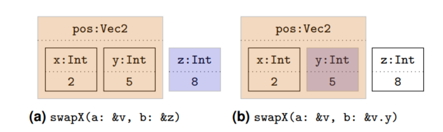

# Language Design

**Yo** is general-purpose, compiled programming language that incorporates the Linear Types, Mutable Value Semantics, and (Poor man's) Algebraic Effects.

**Yo** aims to be a simple to learn programming language for C and JavaScript (TypeScript) programmers 😉.

**Yo** has a syntax design that looks like TypeScript, and uses uniform function call syntax (dot notation)~~, brace elison~~ to make the code more concise.

**Yo** (will &) tend to support advanced type system features such as generalized algebraic data types (GADT), dependent types, refinement types `In Design`.

Our goal is to be a practical language that is easy to use and easy to learn.

We will also post a series of articles on the design and implementation of **Yo**. Stay tuned!

<!-- @import "[TOC]" {cmd="toc" depthFrom=2 depthTo=6 orderedList=false} -->

<!-- code_chunk_output -->

- [Philosophy](#philosophy)
- [Inspiration](#inspiration)
- [Hello World](#hello-world)
- [CLI Usage](#cli-usage)
- [Types](#types)
  - [Type](#type)
    - [`Free` Types](#free-types)
    - [`Linear` Types.](#linear-types)
  - [Variable Declaration](#variable-declaration)
    - [`expr` declaration](#expr-declaration)
      - [Macro using `expr`](#macro-using-expr)
      - [`expr` lexical scope](#expr-lexical-scope)
    - [No duplicate variable declaration](#no-duplicate-variable-declaration)
  - [Type inference](#type-inference)
    - [Uninitialized variable `In Design`](#uninitialized-variable-in-design)
    - [Type bounds `In Design`](#type-bounds-in-design)
  - [Transfer ownership](#transfer-ownership)
  - [immutable and mutable references](#immutable-and-mutable-references)
  - [Unique Pointer `In Design`](#unique-pointer-in-design)
  - [Cast Linear to Free](#cast-linear-to-free)
- [Mutable Value Semantics](#mutable-value-semantics)
  - [Second-Class References](#second-class-references)
  - [Parameter passing modes](#parameter-passing-modes)
  - [RAII](#raii)
  - [Reverse Application Operator](#reverse-application-operator)
- [Function Declaration](#function-declaration)
  - [Named arguments](#named-arguments)
  - [Contextual parameters, aka implicit parameters](#contextual-parameters-aka-implicit-parameters)
    - [Compiletime](#compiletime)
    - [Runtime](#runtime)
  - [Uniform Function Call Syntax](#uniform-function-call-syntax)
    - [Priority](#priority)
  - [`defer`](#defer)
  - [`recur` `In Design`](#recur-in-design)
  - [Custom Operators](#custom-operators)
  - [Variadic functions `In Design`](#variadic-functions-in-design)
- [Duck Typing `In Design`](#duck-typing-in-design)
- [Tuple](#tuple)
- [Array & Slice](#array--slice)
  - [Range with `..`](#range-with-)
- [Closure `In Design`](#closure-in-design)
- [Mutability `To be updated`](#mutability-to-be-updated)
- [Generic](#generic)
  - [Type parameters](#type-parameters)
  - [Type constraints](#type-constraints)
- [Control Flow](#control-flow)
  - [if/else](#ifelse)
  - [while](#while)
  - [for](#for)
  - [do while](#do-while)
    - [Iterator (for...in)](#iterator-forin)
- [Type synonyms](#type-synonyms)
- [Algebraic Data Types (ADT)](#algebraic-data-types-adt)
  - [Type parameters for specific variant](#type-parameters-for-specific-variant)
- [C struct](#c-struct)
- [C union](#c-union)
- [C enum](#c-enum)
- [Advanced Types `In Design`](#advanced-types-in-design)
  - [Dependent types `In Design`](#dependent-types-in-design)
  - [Refinement types `In Design`](#refinement-types-in-design)
  - [Higher Kinded Types](#higher-kinded-types)
  - [Generalized Algebraic Data Types (GADTs) `In Design`](#generalized-algebraic-data-types-gadts-in-design)
- [Trait](#trait)
  - [`impl` a type](#impl-a-type)
  - [Associated types](#associated-types)
  - [Without trait](#without-trait)
  - [Optional class](#optional-class)
  - [Type constraints alias using `expr`](#type-constraints-alias-using-expr)
  - [Named impl `In Design`](#named-impl-in-design)
  - [Higher Kinded Types example](#higher-kinded-types-example)
- [Pattern Matching](#pattern-matching)
  - [Using Range in `case`](#using-range-in-case)
- [Guard](#guard)
- [Pointers](#pointers)
  - [Thin pointers](#thin-pointers)
    - [Linear pointers](#linear-pointers)
  - [Fat pointers](#fat-pointers)
- [String](#string)
  - [C String](#c-string)
  - [UTF-8 string literal](#utf-8-string-literal)
  - [String (Immutable String)](#string-immutable-string)
- [Collections `In Design`](#collections-in-design)
  - [ARC Collections](#arc-collections)
    - [ArrayList](#arraylist)
    - [Map](#map)
- [Error handling `In Design`](#error-handling-in-design)
  - [By algebraic effects](#by-algebraic-effects)
  - [By data type](#by-data-type)
  - [The `?` postfix operator](#the--postfix-operator)
  - [Recovering from errors with the `??` infix operator](#recovering-from-errors-with-the--infix-operator)
- [Type casting](#type-casting)
  - [Type casting in destructuring](#type-casting-in-destructuring)
- [Callbacks and Async `In Design`](#callbacks-and-async-in-design)
  - [Simplify using `with <-` keyword](#simplify-using-with---keyword)
    - [with <-](#with--)
    - [with <= and <<=](#with--and-)
  - [`K` (continuation)](#k-continuation)
- [Modules](#modules)
- [Dynamic Dispatch `In Design`](#dynamic-dispatch-in-design)
  - [`dyn` keyword](#dyn-keyword)
  - [Examples](#examples)
- [Attributes](#attributes)
- [C Interoperability](#c-interoperability)
  - [To C](#to-c)
  - [From C](#from-c)
- [Naming Convention](#naming-convention)
- [Compilation `In Design`](#compilation-in-design)
- [Meta-programming `In Design`](#meta-programming-in-design)
  - [Underscore](#underscore)
  - [Macro](#macro)
- [References](#references)

<!-- /code_chunk_output -->

## Philosophy

It's just a combination of "Lisp" and "C"!  
Yo has no keywords!
Everthing is a function, even the `if`, `while`, `match`, etc.
Extended with a little bit of functional programming.
Interpret as much as possible. Otherwise, compile!

Explicit is better than Implicit.  
Strict is better than Loose.

QUESTION: Should be allow hidden control flow?
ANSWER: No

QUESTION: Should we disable the RAII?
ANSER: No. What's the point of having linear types if we use RAII?

IDEA: Try to run the program without involving heaps. For example, us existential types instead of dynamic dispatch to avoid the heap memory allocation.

IDEA: No Deref trait like in the Rust, as it is a bit implicit.

## Inspiration

The **Yo** language is heavily inspired by:

- [TypeScript](https://www.typescriptlang.org/)
  - Syntax and semantics
  - Module system
- [Koka](https://koka-lang.github.io/)
  - ~~Brace elision~~
  - ~~Dot notation (Uniform Function Call Syntax)~~
  - ~~Perceus and reuse~~
  - ~~Algebraic effects~~
- [Rust](https://www.rust-lang.org/)
  - ~~Borrow checker~~
  - ~~Lifetime~~
  - Pattern matching
- [Austral](https://austral-lang.org/)
  - Linear types
  - ~~Borrowing~~ Replaced with 2nd-Class Reference
- [Haskell](https://www.haskell.org/)
  - ~~Type and typeclass~~
- [OCaml](https://ocaml.org/)
  - Module system
- [Python](https://python.org/)
  - Keyword arguments
- [C++](https://isocpp.org/)
  - Reference
- [Scheme (Lisp)](https://www.scheme.com/)
  - `set!`
  - [Meta-programming (Macros)](https://docs.racket-lang.org/reference/quasiquote.html)
- [Zig](https://ziglang.org/)
  - Compile time execution
  - `defer`
- [Elixir](https://elixir-lang.org/)
  - [Meta-programming (Macros)](https://hexdocs.pm/elixir/quote-and-unquote.html)
- [Nim](https://nim-lang.org/)
  - [Custom Operators](https://nim-lang.org/docs/manual.html#lexical-analysis-operators)
- [Io](https://iolanguage.org/)
  - Minimal syntax and semantic

Other languages that are worth mentioning that have influenced **Yo**:

- [Effekt](https://effekt-lang.org/)
- [PureScript](https://www.purescript.org/)
- [Clojure](https://clojure.org/)
- [Ante](https://antelang.org/)
- [ATS](https://www.ats-lang.org/)
- [Lean](https://leanprover.github.io/)
- [Swift](https://swift.org/)
- [Go](https://go.dev/)
- [Ada](https://www.adacore.com/)
- [Lobster](https://aardappel.github.io/lobster/README_FIRST.html)
- [dyon](https://github.com/PistonDevelopers/dyon)
- [Vale](https://vale.dev/)
- [hylo](https://www.hylo-lang.org/)

## Hello World

```rust
main := ()-> {
  println("Hello World!");
}
```

## CLI Usage

```bash
yo --help
yo --version
yo init # Create a new project in the current directory

# Compilation
yo hello.yo -o hello
yo hello.yo --c-compiler clang -o hello
yo hello.yo --target wasm -o hello.wasm

# Package management
yo install # Install dependencies defined in `yo.json` and `yo.lock`
yo install package-name # Install a specific package
yo install package-name@version # Install a specific version of a package
yo install --global package-name # Install a package globally
yo uninstall package-name # Uninstall a package

# package-name could be
#   github:shd101wyy/some-package@master

# Run scripts
yo run test

# Format code
yo format
```

## Types

A type can have the following **Kind**:

- Type
  - Free
    - i32
    - u32
    - ...
  - Linear
- Interface

### Type

#### `Free` Types

- `boolean` (true or false)
- `u8` (8-bit unsigned integer)
- `u16` (16-bit unsigned integer)
- `u32` (32-bit unsigned integer)
- `u64` (64-bit unsigned integer)
- `i8` (8-bit signed integer)
- `i16` (16-bit signed integer)
- `i32` (32-bit signed integer)
- `i64` (64-bit signed integer)
- `f32` (32-bit floating point)
- `f64` (64-bit floating point)
- `usize` (pointer size. It's `u32` on 32-bit system, `u64` on 64-bit system)
- `isize` (signed pointer size. It's `i32` on 32-bit system, `i64` on 64-bit system)
- `()` (unit type, same as the `void` in C)
- `char` (utf-8 character)
- ~~`symbol` (a unique identifier)~~

#### `Linear` Types.

Linear types are types that can only be used exactly once. For example, a `String` is a linear type as it can only be used once.  
The [Austral language](https://austral-lang.org/) has a very good explanation on the incentive of using [Linear Types](https://austral-lang.org/tutorial/linear-types).

- Linear values must be consumed once.
- A Linear value cannot be consumed when there is a pointer or alias to it.

### Variable Declaration

Like `rust`, **Yo** defines variables with `:=` operator.

```rust
               // compt here means compile-time known
mut(x) := 5;   // x: compt(i32), mutable
mut(x) := 5    // x: compt(i32), mutable
y := 5;        // y: compt(i32), immutable

// or
(:=) x, 5     // x: compt(i32), immutable

// with explicit type declaration
(mut(x) : i32) := 5; // x: i32, mutable
(y : i32) := 5    ; // y: i32, immutable

defn example(x: i32, y: i32), {
  x = 1; // Error: x is immutable
  y = 2; // Error: y is immutable
}

// with `mut` modifier
defn another_example(mut(x): i32, y: i32), {
  x = x + 1; // x is mutable,
  y = 2; // Error: y is immutable
}
```

#### No variable shadowing

```rust
x := 1;
x := 2; // Error: x is already declared
{
  x := 2; // Error: x is already declared
}
```

Below is allowed as they are in different regions:

```rust
{
  x := 1;
}
{
  x := 2;
}
```

### Type inference

```rust
(my_string: String) := String.from("Hello, world"); // Stored on heap. Linear type.
my_string_2 := my_string; // my_string_2: String. Linear type. my_string is moved and consumed. my_string_2 now takes the ownership.
my_string_3 := my_string; // Error: my_string is already consumed.
&my_string_2; // my_string_4: &String, Free type

my_int := 1; // Stored on stack. Free type
my_int_2 := my_int; // my_int_2: i32, Free type

(my_int_array: Array(i32, 3)) := [1, 2, 3]; // Stored on stack, with size 3. Free type
(my_int_array: Array(i32, 100)) := [1, 2, 3]; // Stored on stack, with size 100. Free type
my_int_array := [1, 2, 3]; // Array(compt(i32), 3); Free type
(my_array_list: ArrayList(i32)) := ArrayList.from([1, 2, 3]); // Stored on heap. Linear type.

(my_set: Set(i32)) := Set.from([1, 2, 3]); // Stored on heap. Linear type.
Map.from([
  ["one", 1],
  ["two", 2],
]); // Stored on heap. Linear type.

Person := // Linear type, as it contains a linear type.
  type .Person((String, i32))

p := Person.Person (String.from("Alice"), 30); // p: Person. Linear type.
// or:
p: Person := .Person (String.from("Alice"), 30); // p: Person. Linear type.
(Person.Person (name, age)) := p; // name: String, age: i32
```

#### Uninitialized variable `In Design`

```rust
mut(x) : i32; // mut(x): i32, uninitialized

// Compiler prevents using uninitialized variable.
println(x); // Compiler Error: x is uninitialized.

x := 1; // x: i32, initialized

y : i32; // y: i32, uninitialized
y = 12; // Compiler Error: cannot assign to constant.
```

#### Type bounds `In Design`

From Scala.

- `:` (Colon)

  - Usage: Typically used in type annotations or pattern matching.

- `:>` (from F#) or `<:` (from Scala) (Upper Type Bound)
  - Usage: Indicates that a type parameter must be a subtype of a specific type.  
    PROBLEM: doesn't look good in the generic syntax, as we are using `<...>` for generics.
    PROBLEM: This operator is hard to remember, and introduces complexity to the language.

### Transfer ownership

Linear types can only be used once. When a linear type is transferred, it is consumed and cannot be used again.

```rust
x := String.from("Hello"); // x: String. Linear type
y := x; // y: String. Linear type. x is moved and consumed.
z := x; // Compiler Error: x is already consumed.
```

### immutable and mutable references

```rust
{
  mut(x) := 1; // x: copied i32. Free type
  p1 := &!(x).as(*!(i32)); // p1: *!(i32). Free type
  p2 := &!(x).as(*!(i32)); // p2: *!(i32). Free type.
  *p1 = 2;
  // x == 2
  // *p1 == 2
  // *p2 == 2
}
```

A longer example:

```rust
extern "C", {
  length: ((x: &(String))-> i32);
  push: ((x: &String, value: String)-> ());
  drop: ((x: String)-> ());
}

defn main(), {
  mut(x) := String.from("Hello, world"); // x: String. mutable

  length(x);  // not allowed, type mismatch
  length(&(x));  // allowed
  length(&!(x));  // allowed

  t := x;                           // transfer ownership

  length(x); // error: cannot access `x` because `x` is consumed.
  length(&x); // error: cannot access `x` because `x` is consumed.
  length(&!(x)); // error: cannot access `x` because `x` is consumed.

  drop(t);                             // consume `t`

  length(x); // error: cannot access `x` because `x` is consumed.
  length(&(x)); // error: cannot access `y` because `t` is consumed.
  length(&!(x)); // error: cannot access `z` because `t` is consumed.
}
```

We can only dereference the free type.

```rust
Person := // Linear type, as it contains a linear type.
  type .Person {name: String, age: i32};

name := String.from("Alice");
p := Person {name, age: 30}; // p: Person. Linear type.

{
  name := p.name; // name: String, Linear type. The `p` variable is consumed
                       // when you extract a linear field from it.
                       // NOTE: If `p` has more than one linear field, then when you destructure, you have to consume all the linear fields, otherwise it will be a compiler error.

  age := p.age; // Compiler Error: `p` is consumed already.
}

{
  Person { name, mut(age) } := p;
}

{
  Person { name, age } := p;
}

{
  age := p.age; // age: i32, Free type. The `p` variable is not consumed
                    // when you extract a free field from it.

  name := p.name; // name: String, Linear type. The `p` variable is consumed
}

{
  Person { name } := p; // name: String, Linear type. The `p` variable is consumed
                    // when you destructure any linear type values from it.
}

{
  Person { age } := p;  // age: i32, Free type. The `p` variable is not consumed
                    // when you destructure only free fields from it.
}

{
  mut(p) := Person { name: String.from("Alice"), age: 30 }; // p: Person. Linear type.
  use &!(p), p_ref -> {
    old_name := (p_ref.name = String.from("Bob")); // old_name: String. Linear type. Take the value out.
    // old_name == String.from("Alice")
  }
}
```

```rust
name := String.from("Alice");
p := Person {name, age: 30}; // p: Person. Linear type.

{ name, age } := p; // p is consumed and become uninitialized.

// QUESTION: Should we allow this? Should we use := or =
p := Person {name, age: 30}; // This is allowed. We restored a consumed value.
```

```rust
mut(x) := [1, 2, 3, 4, 5]; // x: Array(compt(i32), 5). Free type
mut(y) := x; // y: Array(compt(i32), 5). Free type. x is copied to y, not moved.
x(0) = 10;

// x: [10, 2, 3, 4, 5]
// y: [1, 2, 3, 4, 5]
```

```rust
mut(x) := [String.from("Hi"), String.from("World")];

{
  s := x(0); // Compiler Error: Cannot move linear type out of a slice.
}

{
  old := (x(1) = String.from("Earth"));
  // old: String. Linear type. old == String.from("World")
}

// x: [String.from("Hi"), String.from("Earth")]
```

### Unique Pointer `In Design`

We use the `^` to denote the pointer, same as in Pascal.

```rust
some_int_ptr := malloc(sizeof(i32)); // int_ptr: Option<^i32>. Linear type
match some_int_ptr,
  .Some(int_ptr) -> { // int_ptr: ^i32. Linear type.
    *(int_ptr) = 10;
    free(int_ptr);
  },
  .None -> {
    // handle error
  }
```

### Cast Linear to Free

NOTE: This is unsafe and should be avoided.

```rust
x := String.from("Hi"); // x: String. Linear type
y := cast_to_free(x); // y: String. Free type
```

## Mutable Value Semantics

Guarantee memory safety in low-level programming language is hard.  
Rust uses the borrow checker to ensure memory safety, but it adds complexity to the language and burden to the programmer.  
Mutable Value Semantics in contrast is a restriction to first-class references which makes you lose some generality but gain simplicity.
Raw pointer is a natural thing in low-level programming languages. It's unavoidable.
The goal of the **Yo** language is to let you write workable and kinda memory-safe code without the need to use raw pointers.

### Second-Class References

References in **Yo** are second-class citizens.

- Can't be stored in ~~data structures or~~ variables.
- ~~Can't be returned from functions.~~ Can't return the reference to local variables in function body, but can return the references that are the function arguments or from the function arguments.
- Can only be created at function call sites, as a special parameter-passing mode.
- Path to a value never appears twice in the function arguments. Path uniqueness.

  

  In this example, `(a)` is allowed while `(b)` is not allowed.

NOTE: We need to allow to store references in data structures in order to support closures.  
NOTE: Why cannot store as variables:

```rust
x := String.from("Hello"); // x: String. Linear type
y := String.from("World"); // y: String. Linear type
l := longest_str(x.as_bytes(), y.as_bytes()); // l: &str;
drop(x);
drop(y);
println(l); // Use after free
```

```rust
Container :=
  type .Container {
    value: &(String)
  };

x := String.from("Hello"); // x: String. Linear type
y := String.from("World"); // y: String. Linear type
c := Container.Container { value: longest_str(&(x), &(y)) }; // c: Container that contains &String.
drop(x);
drop(y);
println(c.value); // Use after free
```

```rust
Container :=
  type .Container {
    value: &(String);
  }

some_func := (o: &!(Container), v: &(String))-> {
  o.v = v; // Not allowed. v might have shorter lifetime than o.
}
```

### Parameter passing modes

NOTE: Why not use `inout`, `in`, and `out` keywords? Because it doesn't work with slice types, which requires `&` ahead of it.

- `&!`

  The `&!` parameter is a reference to a value that can be read and written.

  ```rust
  defn swap(a: &!(i32), b: &!(i32)), {
    temp := *a;
    *a = *b;
    *b = temp;
  }
  mut(x) := 1;
  mut(y) := 2;
  swap(&!(x), &!(y));
  ```

- `&`

  The `&` parameter is a reference to a value that can only be read.

  ```rust
  defn print(x: &(i32)), {
    println(x);
  }
  x := 1;
  print(&(x));
  ```

### RAII

**Might not be supported**

**Yo** supports the RAII to automatically insert the `drop` function when the variable of linear type goes out of scope.

```rust
defn test(), {
  x := String.from("World!");

  // `drop(x)` will be automatically inserted here.
}
```

### `use` statement

```rust
defn return_self(v: &(String)): &(String), v;

x := String.from("Hello, ");
y := String.from("world");
use return_self(&(x)), v -> {
  println(v + y);
}; // Compiler can optimize this part of code.

use &(y), y_ref-> {
  println("Used y reference here");
}
```

## Function Declaration

Function parameters are immutable by default.

```rust
// Top level function.
defn add(x: i32, y: i32):i32, // function name and type
  x + y // body
;

// Type after `->` is the return type. If it's not specified, it's `()`.
add : (x: i32, y: i32)-> i32; // Define the function type
println(add(3, 4)) // Function hoisting is allowed.
add := (fn(x, y)-> { // Actually function definition
  return x + y;
});

// or
add := ((fn(x: i32, y: i32): i32) -> {
  return x + y; // The last expression is the return value.  `return` is optional.
});

// or
(add : (i32, i32)-> i32) = (fn(x, y)-> x + y);

last_unit_expr := (fn(x: i32, y: i32)-> {
  x + y;
  // This is allowed as the last expression is `()`.
});

// Default parameter values
add := ((fn((x:i32) = 1, (y:i32) = 2): i32) -> {
  return x + y;
});
add(); // 3
add(y: 3); // 4
add 2, 3; // 5

// Function argument labels, and parameter names
defn mul(x: i32, by: i32):i32, {
  y := by;
  x * y
};
mul(3, by: 4); // 12
mul 4, by: 5;  // 20
(mul 5, 6);    // 30

// Named return values
defn exponent(base: i32, power: i32):
  ( result: i32,
    some_ref: *i32),
{
  mut(r) := 1;
  mut(i) := 0;
  while i < power, i += 1, {
    r *= base;
  }
  return (r, &(r).as(*(i32)));
};

// Generic function
defn identity(T: Type, arg: T): T,
  arg;
/// or using forall
forall (T: Type),
  defn identity_with_for_all(arg: T): T,
    arg;

x := identity(i32, 12); // x: i32
y := identity_with_for_all(13); // y: i32

// Dependency injection
main := (?(raise): (error: &(str))-> i32)-> {
  (x:i32) := raise("Hello, world");
}

// Value constraint `In Design`
NotZero := i32 |: <@ != 0;
defn divide(x: i32, y: NotZero): i32,
  x / y;

// Type constraint
forall ((T: Type) <: Integral),
  defn add(x: T, y: T): T, {
    return x + y;
  };

// Closure
mut(y) := 0;
use &!(y), y_ref -> {
  add := ((fn(x: i32): i32)=> {
    *(y_ref) = x + *(y_ref);
    return *(y_ref);
  });
  add(1); // 1
  add(1); // 2
}

// y == 2
```

NOTE: Below is allowed

```rust
some_func:  forall (T <: (Trait1 & Trait2)), (x: T)-> T =
            forall (X <: Trait1), fn(x: X)-> x;
```

but this is not allowed

```rust
some_func: forall (T <: Trait1), (x: T)-> T =
           forall (X <: (Trait1 & Trait2)), fn(x: X)-> x;
```

### Named arguments

```rust
defn add(x: i32, y: i32): i32, {
  return x + y;
}
add(y: 2, x: 1); // 3

// QUESTION: Should we allow this?
// You can also call a function without the parentheses:
add y: 2, x: 1; // 3
```

### Contextual parameters, aka implicit parameters

The contextual parameters are passed implicitly to the function.  
**Yo** looks for the closest value that matches the contextual parameter by the **type**, not by **name**.

NOTE: `implicit` should be part of the `type`.

```rust
defn some_async_func(?(_): Async(i32)): i32, {
  // Here we didn't give a parameter name for the implicit parameter.
}
```

#### Compiletime

```rust
// id.yo
defn Id(Self: Type),
  interface {
    id: ((self: Self)-> Self)
  };

impl Id(i32), {
  id: (fn(self) -> {
    return self;
  })
};

{ Id } // Export Id

// main.yo
{ Id } := import "./id.yo";

(12).id(); // 12
use_id := forall ((T: Type) <: Id), (fn(x: T): T)-> {
  return x.id();
}
```

#### Runtime

```rust
defn add(x: i32, ?(y): i32): i32, {
  return x + y;
}

defn main(), {
  {
    add(3); // error: missing implicit parameter type i32
  }
  {
    ?(y) := 4;
    add(3); // ok, 7
  }
  {
    ?(a) := 4;
    (?(_): i32) = 5; // without giving a name
    add(3); // will pick the closest value, which is 5, so it's 8
  }
  {
    add(3, 4); // ok, 7
  }
  {
    ?(y) := 4;
    ?(y) := 5;
    add(3); // ok, 8
  }
}
```

The arguments are provided in lexical scope, not dynamic scope.

```rust
defn test(x: i32, ?(id): ((x: i32)-> i32)), {
  print(id(x))
}

?(id) := (fn(x: i32)-> x);
defn use_test(), {
  test(3); // print 3

  ?(id) := (fn(x: i32)-> x + 1);
  test(3); // print 4
}

defn main(), {
  ?(id) := (fn(x: i32)-> x + 2); // This will not affect the `test` function calls in `use_test`
  use_test();   // print 3
                // print 4
}
```

### Uniform Function Call Syntax

DEPRECATED: Use traits instead.
IDEA: Actually let's still keep it. For the functions define in `impl` or `trait`, we don't allow to extract them and we force to call these functions with `.`.

```rust
g(f(a, b), x, y);
// can be written as
a.f(b).g(x, y);
```

```rust
defn add_one(x: i32): i32, {
  return x + 1;
}

(12).add_one(); // 13
// is equalvalent to
add_one(12); // 13

s := String.from("Hello, world");
s.length(); // 12
// is equalvalent to
length(&(s)); // 12
// We will automatically convert to reference when needed.
```

#### Priority

Record field access has higher priority than the free function and trait method.

```rust
S := {
  (method: (()-> ())) =
    (fn()-> println("Record method"))
}

method := (fn(s: S)-> {
  println("Free function");
})

SomeInterface := fn(Self: Type)->
  interface {
    (method: (self: &(Self))-> ()) =
      fn()-> println("Trait method")
  }

impl SomeInterface(S), {}

fn main(), {
  (s : S) := {};
  s.method();  // Record method
  method(s);   // Free function
  s.method();  // Record method
  SomeInterface(S).method(&(s)); // Interface method
}
```

### `defer`

`defer` will execute an expression at the end of the current scope.

```rust
defn test(), {
  x := String.from("World!");
  defer {
    println(x);
    drop(x);
  };

  y := String.from("Hello, ");
  defer {
    println(y);
    drop(y);
  };
}

test(); // Hello, World!
```

```rust
defn defer_example(), {
  mut(a) := 1;

  {
    defer a = 2;
    a = 1;
  }

  println(a); // 2
  return a;
}
```

### `recur` `In Design`

Use the `recur` to call the function recursively.  
This is useful for anonymous function.  
If `recur` is the last expression, tail-call optimization will be applied.

- With tail-call optimization

  ```rust
  fn(x: u32, acc: u32 = 1)->
    if x == 1, then:
      acc
    else:
      recur(x - 1, acc * x)
  ```

- Without tail-call optimization

  ```rust
  fn(x: u32)->
    if x == 1, then:
      1
    else:
      x * recur(x - 1)
  ```

### Custom Operators

```rust
(|>) := forall (T: Type, U: Type, (F: Type) <: (FnOnce(value:T)-> U)), (fn(x: T, f: F): U)-> {
  return f(x);
}

12 |> add_one; // 13

(|>)(12, add_one); // 13

((|>) 12, add_one) ; // 13
```

### Variadic functions `In Design`

```rust
defn print(...(args)), {
  // @va_start(args); // Start the variadic arguments
  args2 := @va_copy(args); // Copy the variadic arguments
  mut(i) := 0;
  while i < args.length, i += 1, {
    printf("%d ", @va_arg(args, i32)); // Pop the variadic argument and set it to i32
  }
  // @va_end(args); // End the variadic arguments
}
```

## Duck Typing `In Design`

```rust
// This function can take any type that has a `length: i32` property.
defn print_length(x: *({ length: i32 })), {
  println(x.length);
};

defn main(), {
  s := String.from("Hello, world");
  print_length(&(s));
  // ^ This works as the compiler converts it to below from the background:
  print_length(&({ length: s.length }))
}
```

## Tuple

Tuple is defined as a sequence of elements of different types, separated by commas and enclosed in parentheses.

```rust
my_unit := (); // my_unit: (). Free type

my_i32_tuple := (12);  // my_i32_tuple: i32
// Needs extra comma to make it a tuple
my_i32_tuple := (12,); // my_i32_tuple: (i32,). Free type

(i32_tuple: (i32, i32, i32)) = (1, 2, 3); // tuple: (i32, i32, i32). Free type

mixed_tuple := (1, true, "Hello"); // mixed_tuple: (i32, boolean, *u8[6,'\0']). Free type

(a, b, c) := mixed_tuple; // a: i32, b: boolean, c: *u8[6,'\0']. Free type

a := mixed_tuple.0;
b := mixed_tuple.1;
c := mixed_tuple.2;

// NOTE: for tuple that has only 1 element, we need to add a comma to make it a tuple.
MyTuple := (i32)
// is equivalent to
MyTuple := i32;
// to make it a tuple, we need to add a comma
MyTuple := (i32,);
```

## Array & Slice

```rust
mut(i32_array) := [1, 2, 3, 4, 5]; // mut(i32_array): Array(compt(i32), 5). Free type
                                 // In C: int i32_array[5] = {1, 2, 3, 4, 5};
i32_array.length; // 5, compile-time known

(i32_array2 : Array(i32, _)) = [1, 2, 3]; // i32_array2: Array(i32, 3)

immutabl_i32_array := [1, 2, 3, 4, 5]; // immutabl_i32_array: Array(i32, 5). Free type
                                            // In C: const int immutabl_i32_array[5] = {1, 2, 3, 4, 5};

// Convert from array to slice using `&`
i32_array_ptr := &(i32_array); // i32_array_ptr: Slice(i32). Free type
i32_array_ptr.length; // 5, runtime known
i32_array_ptr(0) = 8; // automatically dereference
// i32_array: [8, 2, 3, 4, 5]

use &!(i32_array(0)), ptr -> {
  *(ptr) = 9;
}l
// i32_array: [9, 2, 3, 4, 5]
```

Slice in **Yo** is a reference to an array. It is a pointer to the first element of the array and the length of the slice calculated from the **runtime**.

QUESTION: We do we need `&` before slice?
ANSWER: Yes we do. Not only because the size of slice is unknown at the compile-time, when we use it in function parameter, we also need to know if its mutability by & or &mut.

- For array of linear type, we need to convert it to a slice of free type, so it requires `&`.
- Slices are dynamically sized, so its size is unknown at compile time. We need to use `&` to coerce the array to a slice.

```rust
(i32_array : Array(i32, _)) := [1, 2, 3]; // i32_array: Array(i32, 3). Free type
i32_slice := &(i32_array); // i32_slice: &Slice(i32). Free type
i32_slice := i32_array(0..some_func_return_usize());  // i32_slice: i32[]
                                                        // Compiler Error: The size of the slice is not known at compile time.
                                                        //                 Please use `&` to coerce i32_array to slice type &(Slice(i32))
i32_slice := &(i32_array(0..some_func_return_usize()));
i32_slice.length; // 3, runtime known
i32_slice(0) = 10;
// i32_array: [10, 2, 3, 4, 5]


defn set_value(arr: &!(Slice(i32)), index: usize, value: i32),
  if index < arr.length,  // arr.length is runtime known
    arr(index) = value;

set_value(i32_array, 0, 11); // Compiler error: Please use `&` to coerce i32_array to slice type i32[]
set_value(&!(i32_array), 0, 11); // Correct!
// i32_array: [11, 2, 3, 4, 5]
// i32_slice: [11, 2, 3]


set_value := fn(arr: Slice(i32), index: usize, value: i32)-> { // Compiler Error: The size of the slice is not known at compile time.
                                                           //                 Please use `&` to coerce arr to slice type &i32[]
  // ...
}

// This is also allowed as the size of the array is known at compile time.
set_value_3 := fn(arr: Array(i32, 3), index: usize, value: i32)-> {
  // ...
}
```

### Range with `..`

```rust
// The range start..end contains all values with start <= x < end.
// It is empty if start >= end.
Range := type .Range {
  start: i32,
  end: i32,
}

range := (0 .. 5); // range: Range. Free type
range := Range {
  start: 0,
  end: 4,
};

range2 := (0 ..= 5); // range2: Range<i32>. Free type, including the end value
range2 := Range {
  start: 0,
  end: 5,
}
```

## Closure `In Design`

NOTE: Closure is a `class`, not `type`.

The closure in **Yo** is a function that can capture ~~Linear~~ values from the outer scope.  
**Yo** only supports **explicit captures** in closures.
**Yo** **doesn't** support references in captured values.

The closure type is defined as:

- Closure that can be called once:
  ```
  FnOnce<type parameters>(parameters)-> return_type
  ```
- Closure that can be called multiple times:
  ```
  FnMut<<type parameters>(parameters)-> return_type>
  Fn<<type parameters>(parameters)-> return_type>
  ```

A closure can be defined using the following syntax:

- `FnOnce`:

  ```
  <type parameters>(paramters)=>> return_type { body }
  ```

- `FnMut` and `Fn` are the same as normal function, but will be automatically converted:
  ```
  <type parameters>(paramters)=> return_type { body }
  ```

QUESTION: Should we make the captures explicit?

Examples:

```rust
defn test(), {
  mut(x) := 1;

  use fn(a: i32)=> {
    *(x) = *(x) + a;
  }, (increment)-> {
    increment(1);
    increment(2);
  };
  // x == 4
};
```

```rust
defn test(), {
  (x: Data) := malloc(); // Some `Fake` Data.

  increment := (fn() => {
    drop(x);
  });
  increment(); //
  increment(); // Compiler Error: closure is already consumed.
}
```

**NOTE:** We can pass normal function ()->() to a function argument that expects a closure, but not the other way around.

## Generic

### Type parameters

Type is first-class citenzen in Yo

```rust
defn id(T: Type, x: T): T, {
  return x;
}
```

### Type constraints

Type constraints are achieved using the `<:` operator.

```rust
// Type constraints
defn three_are_equal((T: Type) <: Eq, x: T, y: T, z: T): boolean, {
  return (x == y) && (y == z);
};
// (T: Type) <: Eq is equivalent to (T: Type) <: Eq(T)

defn show_compare((T: Type) <: (Show & Ord), x: T, y: T): String,
  match compare(x, y),
    .LT -> "Less than",
    .EQ -> "Equal",
    .GT -> "Greater than"
;

// Instance dependencies
forall ((A: Type) <: Show, size: compt(usize)),
  impl Show(Array(A, size)), {
    show: (fn(self)-> {
      // ...
    })
  };

forall ((A: Type) <: Show,
        (B: Type) <: Show),
  impl Show((A, B)), {
    show: (fn(self)-> {

    })
  };
```

```rust
// show.yo
defn Show(Self: Type): Interface,
  interface {
    show: ((self: &(Self))-> String)
  };

impl Show(i32), {
  show: (fn(self)-> {
    // ...
  })
};

impl Show(String), {
  show: (fn(self)-> {
    // ...
  })
};

{ Show } // export Show


// main.yo
{ Show } := import "./show.yo";

forall ((T: Type) <: Show, size: compt(usize)), defn show(x: Array(T, size)): String, {
  // ...
};
{ show } // export show


{ Show } = import "./show.yo";
forall ((T: Type) <: (Ord & Show)),
  defn less_than(x: T, y: T): boolean, {
    println(x.show());
    return x < y;
  };
```

## Control Flow

### if/else

`if(condition, then, else)`

```rust
defn main(), {
  // If no return type, it is `()`
  number := 3;

  if number < 5, then: {
    println("condition was true");
  },
  else: {
    println("condition was false");
  };

  if(number < 5, println("condition was true"), println("condition was false"));
};
```

### cond

```rust
defn use_cond(x: i32),
  cond x == 1 -> println("x is 1"),
       x == 2 -> println("x is 2"),
       true   -> println("x is not 1 or 2")
```

### while

`while(condition, do: body)` or
`while(condition, iteration, do: body)`

```rust
defn factorial(n: i32): i32, {
  mut(result) := 1;
  mut(i) := 1;
  while i <= n, do: {
    result = result * i;
    i += 1;
  };
  result
};

defn factorial(n: i32): i32, {
  mut(result) := 1;
  mut(i) := 1;
  while i <= n, i += 1, result = result * i;
  result
}
```

#### Iterator (for...in)

```rust
arr := ArrayList.from([1, 2, 3, 4, 5]);
for arr.iter(), (value)-> { // NOTE: arr.iter() returns a record that contains `&` reference to `arr`
  // value here has type &i32
  println(value);

  // NOTE: Use of `arr` is prohibited here.
};

mut(mut_arr) = ArrayList.from([1, 2, 3, 4, 5]);
for mut_arr.iter_mut(), (value)-> {
  // value here has type &mut i32
  *value += 1;
};
```

`let...of...` requires the `impl Iterator` or `impl IntoIterator` trait.

```rust
defn Iterator(Self: Type): Interface,
  interface {
    Item: Type;
    next: (self: &!(Self))-> Option(this.Item);
  };

defn IntoIterator(Self: Type): Interface,
  interface {
    Item: Type;
    (IntoIterator: Type) <: Iterator(_, Item: this.Item);
    // QUESTION: Should we group it as?
    // IntoIterator: (Type <: Iterator(_, Item: this.Item))

    // IntoIterator will consume the value, while Iterator will not.
    into_iter: ((self: Self)-> this.IntoIterator);
  };
```

## Type synonyms

```rust
// Record
(User: Linear) = {
  active: boolean;
  username: String;
  email: String;
  age: i32;
};

(user: User) := {
  active: true,
  username: String.from("johndoe"),
  email: String.from("test@gmail.com"),
  age: 13
};
```

Extending the records

```rust
/*
type Lang<l> = { language: String | l}; // Intersection types
type Language = Lang<(year: i32)>;
// Language is equal to
type Language = { language: String; year: i32 };
*/
defn Lang(T: Type): Type,
  { language: String } & T; // Intersection types
Language := Lang({year: i32});
// Language is equal to
Language := { language: String; year: i32 };
```

Destructure the record:

```rust
User := type .User {
  name: String,
  age: i32
}

(user: User) := User {
  name: String.from("johndoe"),
  age: 12
}

{
  User {age} := user; // Compiler Error: `user` is consumed while `name` is not moved out.
}

{
  User {name, age} := user;
  // name: String, linear type
  // age: i32. Free type
}

{
  // Rename the field with `:`
  // Specify the type with `as`
  User{name: username, age} := user;
  println(username); // johndoe
  // username: String, linear type.
  // age: i32. Free type.
}
```

## Algebraic Data Types (ADT)

ADT is basically another type of Record with a hidden field `tag` that indicates the variant type.

Therefore, when a value of a variant is decided, we can access the field of the value just like accessing the field of a record.

There is also some optimization on the ADT. For example, if the ADT has only one variant, the `tag` field will be omitted.

In addition, if there is only one variant with one field, the field type will be used directly instead of wrapping it in a record. This is like the [newtype](https://wiki.haskell.org/Newtype) in Haskell.

```rust
defn Option(T: Type): Type,
  type (|
    .Some(T),
    .None);

(none: Option(i32)) = .None;
(some: Option(i32)) = .Some(42);

IpAddr :=
  type (|
    .V4((u8, u8, u8, u8)),
    .V6(String)
  );

home := IpAddr.V4 (127, 0, 0, 1);
loopback := IpAddr.V6 String.from("::1");

// Use record as variant
Message :=
  type (|
    .Quit,
    .Move({ x: i32, y: i32 }),
    .Write(String),
    .ChangeColor({ r: i32, g: i32, b: i32 })
  );

m := Message.Write(String.from("hello"));
m := Message.Move { x: 3, y: 4 };
m := Message.ChangeColor { r: 1, g: 2, b: 3 };
```

### Type parameters for specific variant

```rust
MixedData :=
  type (|
    .NoForall((i32, String)),
    .WithForall: (forall ((T: Type) <: Show),
                  (a: T)-> MixedData)
  );


mixed := MixedData.WithForall(12); // mixed: MixedData.WithForall(i32)
```

## C struct

```rust
Point := type .Point {
  x: i32;
  y: i32;
};

my_point := Point.Point {
  x: 10,
  y: 20
};
// Or
(my_point: Point) := .Point {
  x: 10,
  y: 20
};

```

Compiles to C

```c
struct Point {
  int x;
  int y;
};
```

## C union

```rust
MyNumber := type (|
  { i: i32 },
  { j: f32 });
(my_number: MyNumber) := { i: 10 };
my_number.j = 1.2;
```

Compiles to C

```c
union MyNumber {
  int i;
  float j;
};
```

## C enum

It's the same as the ADT, but all variants have no fields.

```rust
State := type (|
  Working = 1,
  Failed = 0
);

Week := type (|
  Monday, // 0
  Tuesday, // 1
  Wednesay // 2
);

day := Week.Wednessay;
printf("%d", day); // 2
```

## Advanced Types `In Design`

### Dependent types `In Design`

Dependent types are types which depend on values.

```rust
defn Vector(N: compt(i32)): Type,
  Array(i32, N);

forall (N: compt(i32)),
  defn add_vectors(a: Vector(N), b: Vector(N)): Vector(N),
    a.map(fn(x, i)-> (x + b(i)));

(v1: Vector(3)) := [1, 2, 3];
(v2: Vector(3)) := [4, 5, 6];
result := add_vectors(v1, v2); // [5, 7, 9];

// The code below will not compile
(v3: Vector(2)) := [1, 2];
(v4: Vector(3)) := [4, 5, 6];
// error := add_vectors(v3, v4); // Compiler Error: Vector<2> and Vector<3> are different types.
```

### Refinement types `In Design`

Refinement types consists of all values of a given type which satisfy a given predicate.

```rust
PositiveNumber := (compt(i32) |: @ > 0);
NonEmptyString := (compt(String) |: @.length() > 0);

defn divide(x: PositiveNumber, y: PositiveNumber): PositiveNumber,
  x / y;

(x: PositiveNumber) := 10; // Valid
(y: PositiveNumber) := -10; // Compiler Error: -10 is not a PositiveNumber

result := divide(10, 2); // Valid
```

```rust
NaturalNumber := (i32 |: @ >= 0);
PositiveNumber := (i32 |: @ > 0);
forall (n: i32),
  Equal := (i32 |: @ == n);
forall (T: Type, a: Array(T, _)),
  Index := NaturalNumber |: @ < a.length();
forall (T: Type),
  NotEmptyArray := Array(T, _) |: @.length() > 0;

forall (T: Type, a: Array(T, _)),
  defn get(index: Index(T, a), array: a): T,
    array(index);

forall (T: Type, a: Array(T, _)),
  defn set(index: Index(T, a), array: a, value: T): a,
    array(index) = value;

forall (T: Type),
  defn head(array: NotEmptyArray(T)): T,
    array(0);
```

### Higher Kinded Types

Higher Kinded Types are types that take other types as parameters.

```rust
defn T1(F: (Type)-> Type, A: Type): Type,
  F(A);

defn Option(T: Type): Type,
  T1(Maybe, T);
```

### Generalized Algebraic Data Types (GADTs) `In Design`

```rust
defn MyExpr(T: Type): Type,
  type (|
    .IntExpr: ((i32)-> MyExpr(i32)),
    .BoolExpr: ((boolean)-> MyExpr(boolean)),
    .EqExpr: ((Expr(i32), Expr(i32)) -> Expr(boolean))
  );

forall (T: Type),
  defn eval(expr: MyExpr(T)): T,
    match expr,
      .IntExpr(i) -> i,
      .BoolExpr(b) -> b,
      .EqExpr((left, right)) -> eval(left) == eval(right)
;

(expr1 : MyExpr(boolean)) := .EqExpr(.IntExpr(1), .IntExpr(2));
eval(expr1); // false
```

## Interface

Interface works similarly to the Trait in Rust.

```rust
defn Summary(Self: Type): Interface,
  interface {
    summarize: ((self: &(Self))-> String)
  };

defn Display((Self: Type) <: (Summary & SomeOtherClass)): Interface,
  interface {
    display: ((self: &(Self))-> String)
  };

NewsArticle := {
  headline: String;
  location: String;
  author: String;
  content: String;
};

impl Summary(NewsArticle) {
  summarize: (fn(self) -> {
    String.from("${self.headline}, by ${self.author} (${self.location})");
  })
};

// Pass in function
defn notify(item: &(NewsArticle)), {
  println("Breaking news! ", item.summarize());
};

forall ((T: Type) <: Display),
  defn notify(item: &(T)), {
    println("Breaking news! ", item.summarize());
    println("Breaking news! ", item.display());
  };
```

```rust
defn LuckyNumber(T: compt(i32)),
  interface {
    say_it: ((self: &(T))-> ())
  };

impl LuckyNumber(7), {
  say_it: (fn(self)-> {
    println("Lucky number 7");
  })
};

7.say_it(); // Lucky number 7
```

### `impl` a type

NOTE: `impl` a type more than once is allowed. This is how rust behaves.  
QUESTION: Should we allow `impl` a primitive type?  
ANSWER: Yes we allow

```rust
// my_type.yo
defn MyType(T: Type): Type,
  type .MyType { value: T };

forall (T: Type),
  impl MyType(T), {
    // `this` here means `MyType<T>`.
    new: ((fn(value: T): this)-> {
      return MyType {
        value
      };
    })
  };

// main.yo
{ MyType } := import("./my_type");
v := MyType(i32).new(1); // MyType { value: 1 }
```

### Associated types

aka [Functional Dependencies](https://book.purescript.org/chapter6.html#functional-dependencies)

```rust
defn Contains(Self: Type): Interface,
  interface {
    A: Type,
    B: Type,

    contains: ((self: &Self, a: this.A, b: this.B)-> boolean);
            // QUESTION: Do we need `this.` here?
            // ANSWER: Yes. Let's make it the same as typescript.
            // `this` here means `Contains<Self>`.
            // `this.A` means `Contains<Self>.A`.
            // so `this.` is necessary.
  };

Container := (i32, i32);

impl Contains(Container), {
  A: i32;
  B: i32;

  contains: ((fn(self: &(Container), a: this.A, b: this.B): boolean) -> {
    self.0 == a && self.1 == b
  })
}

my_tuple: Container = (10, 20);
my_tuple.contains(10, 20); // true

MyI32 = Contains(Container).A; // i32
Contains(Container).contains(&(my_tuple), 10, 20); // true
```

### Without interface

Use `!(Interface)` to exclude an interface.

```rust
defn Summary((Self: Type) <: (Show & !(Eq))),
  interface {
    summarize: ((self: &(Self))-> String);
  };
// This trait `Summary` can only implement for `Type` that implements `Show` but not `Eq`.
```

### Optional interface

Use `?(Interface)` to make a trait optional.

```rust
defn Summary((Self: Type) <: ?(Show)),
  interface {
    summarize: ((self: &(Self))-> String);
  };
// This trait `Summary` can implement for `Type` that implements `Show` or not.
```

### Named impl `In Design`

This is useful for resolving conflicts when implementing multiple classes for the same type.

```rust
// id.yo
defn Id(Self: Type),
  interface {
    id: ((self: &(Self))-> Self)
  };

{ Id }

// id1.yo
MyIdImplementation := impl Id(i32), {
  id: (fn(self: &(i32)) -> *(self))
};
{ MyIdImplementation }

// id2.yo
impl Id(i32), {
  id: (fn(self: &(i32)) -> (*(self) + 1))
};

// use_id.yo
{ MyIdImplementation } := import("./id1.yo");
MyIdImplementation.id(&(12)); // 13
12.id() // 13, using the `id` from `MyIdImplementation`.
        // QUESTION: Should we allow this 12.id()?

// another_use_id.yo
{ Id } := import("./id.yo");
12.id(); // Compiler Error: Ambiguous call to `id` function.
```

### Higher Kinded Types example

```rust
// Functor
defn Functor(Wrapper: ((Type)-> Type)): Interface,
  interface {
    map: (forall
            (A: Type, B: Type),
            (fa: Wrapper(A), f: ((a: A)-> B))
              -> Wrapper(B))
  };

impl Functor(Maybe), {
  map: (forall
        (A: Type, B: Type),
        (fn(fa: Maybe(A), f: ((a: A)-> B)): Maybe(B)) ->
          match fa,
            .Just(value) -> .Just(f(value)),
            .Nothing     -> .Nothing)
};

forall (T: Type), impl Functor(Either(T)), {
  map: (forall
        (A: Type, B: Type),
        (fn(fa: Either(T, A), f: ((a: A)-> B)): Either(T, B)) ->
          match fa,
            .Left(value) -> .Left(value),
            .Right(value) -> .Right(f(value)))
};


some_maybe := Just(1);
result := some_maybe.map((x)-> x + 1); // Just(2)
```

## Pattern Matching

The compiler implements an exhaustive check on the pattern matching.

```rust
Coin := type (|
  Penny,
  Nickel,
  Dime,
  Quarter
);

// Reference:
// - https://doc.rust-lang.org/book/ch06-02-match.html
// - https://github.com/tc39/proposal-pattern-matching
defn value_in_cents(coin: Coin): u8,
  match coin,
    .Penny -> {
      println("Lucky penny!");
      return 1;
    },
    .Nickel -> 5,
    .Dime -> 10,
    .Quarter -> 25;

defn List(T: Type),
  type (|
    .Nil,
    .Cons((T, Box(List(T))))
  );

forall (T, Type),
  defn list_length(list: &(List(T))):i32,
    match (list),
      .Nil -> 0,
      .Cons(_, tail) -> 1 + list_length(tail)
```

### Using Range in `case`

```rust
defn check_int(x: i32),
  match x,
    (1..=6) -> println("1 to 6:"),
    (7..10) -> println("7 to 10"),
    _ -> println("Other");
```

## Guard

QUESTION: Should we use `|-` operator instead to represent the `assert` meaning?

1. Using `|:` which means `given` for guard

   ```rust
   defn check_int = (x: i32)->
     match x,
       ((1..6) |: ((x % 2) == 0))-> {
         println("1 to 6 and even");
       },
       ((1..6) |: ((x % 2) != 0))-> {
         println("1 to 6 and odd");
       },
       (7..10) -> println("7 to 10");
       _ -> println("Other");
   ```

2. `iflet(let, do)`

   ```rust
   maybe_some := Some(10);
   iflet (.Some(value) = maybe_some), {
     println(value);
   };
   ```

3. `whilelet(let, do)`

   ```rust
   mut(list) = Some(10);
   whilelet (.Some(value) = list), {
     println(value);
     list = None;
   };
   ```

## Pointers

### Thin pointers

In C, there are 4 types of pointers:

- Pointer to a constant
  `const int*`
- Constant pointer to a constant
  `const int* const`
- Pointer to a non-constant
  `int*`
- Constant pointer to a non-constant
  `int* const`

In Yo, these 4 categories are represented as:

```rust
// Pointer to a constant
constant_i32 := 12;
mut(ptr_to_constant) := &(constant_i32); // mut(ptr_to_constant): &(i32)

// Constant pointer to a constant
constant_i32 := 12;
constant_ptr_to_constant := &(constant_i32); // constant_ptr_to_constant: &(i32)

// Pointer to a non-constant
mut(i32_val) := 12;
mut(ptr_to_i32) := &!(i32_val); // mut(ptr_to_i32): &!(i32)


// Constant pointer to a non-constant
mut(i32_val) := 12;
constant_ptr_to_i32 := &!(i32_val); // ptr_to_i32: &!(i32)
```

#### Linear pointers

```rust
// `^` means linear pointer
{
  some_i := malloc(sizeof(i32)); // i: Option(^!(i32));
  i := some_i.unwrap(); // i: ^!(i32); Linear type

  p := i; // p: ^!(i32). Linear type, ownership is transferred.
  free(p);

  println(*(i)); // Compile Error: The value it points to is consumed.
}
```

### Fat pointers

- Slice

```rust
(arr: Array(i32, 5)) := [1, 2, 3, 4, 5];
(slice: &(Slice(i32))) := &(arr(1..4)); // slice: &(Slice(i32)). Free type
```

- Interface Object

```rust
defn Animal(Self: Type): Interface,
  interface {
    speak: ((self: &(Self))-> ())
  };

Dog := type {};
impl Animal(Dog), {
  speak: (fn(self)-> {
    println("woof");
  })
};
(animal: &(dyn(Animal))) := &(Dog);
animal.speak();
```

- Dynamic sized type

```rust
(s: &(str)) := "Hello, world!";
```

## String

### C String

0 terminated string.

```rust
s = "Hello".to_cstring(); // s: *u8
// (const char) *const s1 = "Hello";
```

### UTF-8 string literal

NOTE: Should we support this or just use `String`?

This is not a 0 terminated string.
Similar to the `str` in Rust.
NOTE: UTF-8 is a variable-width encoding (each character can be 1 to 4 bytes long), so we cannot get the `n`th character like `s[n]`.

```rust
immutable_s := "Hello"; // immutable_s: &str, free type
immutable_s.length; // 5

// where it is stored in struct like
str = type {
  data: u8;
  length: usize;
};
```

### String (Immutable String)

UTF-8 encoded string.

```rust
s := String.new();
s2 := String.from("Hello World!");
s3 := s + s2; // Create a new string.
```

## Collections `In Design`

### ARC Collections

#### ArrayList

This is the dynamic array.

```rust
(v: ArrayList(i32, .Arc)) := ArrayList(i32, .Arc).new();
v2 := ArrayList.from([1, 2, 3]);
value := v2.at(0);
```

#### Map

The unordered map.

```rust
(m: Map(String, i32)) = Map.new();
m2 := Map.from([
  (String.from("one"), 1),
  (String.from("two"), 2),
  (String.from("three"), 3),
]);

m.set(String.from("one"), 4);
```

## Error handling `In Design`

### By algebraic effects

```rust
MyError := {
  message: &(str)
};

defn main(?(throw): Exception(MyError)), {
  throw({
    messaeg: "Something went wrong"
  });
};
```

### By data type

```rust
defn divide(x: i32, y: i32): Result(i32, &(str)),
  if y == 0,
  then: .Error("Division by zero"),
  else: .Ok(x / y);
```

### The `try` function

```rust
defn use_safe_divide(): Result(i32, &(str)), do {
  result1 <- try divide(6, 2); // 3
  result2 <- try divide(6, 0); // Error("Division by zero")
  println(result1); // This line and below will not be executed.
};
```

### Recovering from errors with the `??` infix operator

```rust
defn use_safe_divide(): i32, {
  result := (divide(6, 0) ?? 3 ); // 3
  println(result); // 3
  return result;
};
```

## Type casting

Use `as` function to cast a value to another type.

```rust
(x: i32) := 1;
(y: f32) := x.as(f32);
```

### Type casting in destructuring

```rust
arr := [1, 2, 3];
[as(x, f32), y, z] = arr;

obj := {x: 1, y: 2, z: 3};
{as(x: new_name, f32), mut(y), z} := obj;
y = 3; // Allowed
```

## Callbacks and Async `In Design`

### Simplify using `with <-` keyword

QUESTION: How do we handle `for` and `while` loop? `<-` won't be able to work there. Should we still implement loops?
ANSWER: Yes we should.

PROBLEM: How to handle the rust `Pin/Unpin` problem?

Any function that takes a callback as its last argument will be able to use the `with ...` notation.

#### with <-

For example, map an array:

```rust
defn main(), {
  array := ArrayList.from([1, 2, 3, 4]);
  new_array := array.map(fn(elem)-> (elem * 2));
  println(new_array); // [2, 4, 6, 8]
};
```

```rust
defn main(), {
  array := ArrayList.from([1, 2, 3, 4]);
  new_array := do {
    elem <- array.map();
    return elem * 2;
  };
  println(new_array); // [2, 4, 6, 8]
}
```

#### with <= and <<=

Use `<=` for handling passing closure for `Fn` and `FnMut`
Use `<<=` for handling passing the closure for `FnOnce`

```rust
defn some_async_func(), do {
  response <= fetch("https://api.example.com");
  json <= response.json();
  println(json);
};
```

### `K` (continuation)

NOTE: Let's not use `Future` and `async` here in case we want to support Rust like async/await which uses the state machine.
QUESTION: We can support `K` type, but should we support `K` block?

```rust
defn wait_for_seconds(sec: i32): K(()), {
  K.new(fn(resume)=>> {
    set_timeout(fn()=>> {
      println(sec);
      resume();
    }, sec * 1000);
  });
}

defn use_wait(), do {
  // NOTE: Unlike JavaScript Promise, which starts executing immediately, a `K` in Yo will only start executing when it is `resumed`ed.
  sec <- wait_for_seconds(14).resume();
  println(sec);
}
```

## Modules

QUESTION: Should we allow to `export` a linear type value?

~~NOTE: Why not use javascript like import:~~

- To support condtional import in the future.
- To allow import happening in the middle of the code, like inside a function.
- for consistency with the destructuring. Like for javascript, it uses `import {x as y} from "module.ts"` but destructuring uses `let {x: y} = obj`.

```rust
// module1.yo
{ copy } := import "https://github.com/yo-lang/yo/std/fs.yo";

defn test(), {
  println("Hello, world!");
};

{ test, copy } // The last expression of the module will be exported.

// module2.yo
// Export the type
defn Option(T: Type): Type,
  type (|
    .Some(T),
    .None
  );
{ Option }

// module3.yo
// Export the interface.
defn Id(Self: Type): Interface,
  interface {
    id: ((self: Self)-> Self);
  };

// Explicitly export the functions defined in the instance.
// The implementations will be exported implicitly.
impl Id(i32), {
  id: (fn(x) -> x)
};

{ id }
```

```rust

{*} := import("./test.yo"); // Import everything from test.yo
Test := import("./test.yo"); // Import everything from test.yo and put it in the Test namespace
{ test } := import("./test.yo"); // Import test function from test.yo
{ test: test2 } := import("./test.yo"); // Import test function from test.yo and rename it to test2

{ Option } := import("./test.yo"); // Import Option type from test.yo

{ Id } := import("./test.yo"); // Import `Id` class from test.yo
```

`yo.json` and `yo.lock`

```json
{
  "name": "my-project",
  "version": "0.1.0",
  "dependencies": {
    "std": ""
  }
}
```

## Dynamic Dispatch `In Design`

### `dyn` keyword

`dyn` can be applied to `trait` to make it `type` for dynamic dispatch.
~~`@Type(with:)` can be applied to `class` to make it `type` for static dispatch.~~
~~NOTE: `@Type(with:)` is not concrete type. So we can't pass it to type argument.~~

### Examples

```rust
defn Shape(Self: Type): Interface,
  interface {
    area: ((self: &(Self))-> f32)
  };

Circle = type .Circle {
  radius: f32
};
impl Shape(Circle), {
  area:
    (fn(self)->
      3.14 * self.radius * self.radius
    )
};

Square := type .Square {
  side: f32;
};
impl Shape(Square), {
  area:
    (fn(self) ->
      self.side * self.side
    )
};

// Static dispatch
// Similar to C++'s template
forall ((T: Type) <: Shape),
  defn print_area(shape: &(T)),
    println(shape.area());
// or
// NOTE: Below is not going to be implemented for now.
defn print_area(shape: &(impl(Shape))), // This will omit type parameter, and you cannot pass type argument to it.
  printl(shape.area());

(circle: Circle) := Circle { radius: 1.0 };
(square: Square) := Square { side: 2.0 };
print_area(&(circle));
print_area(&(square));

// Dynamic Dispatch - Needs design.
// NOTE: Here we use (dyn Class) as type, so it becomes dynamic dispatch.
/*
It's like in C:

typedef struct {
  float (*area)(void*);
  void* data;
} Shape;

void print_area(Shape* shape) {
  printf("%f\n", shape->area(shape->data));
}
*/
defn print_area(shape: &(dyn(Shape))),
  println(shape.area());

[ // NOTE: We have to add `&` ahead dynamic Trait as it's unsized. It works similar to slice that requires `&` ahead.
  &(circle),
  &(square),
].as((&(Slice(dyn(Shape))))) |> (fn(shapes)-> {
  shapes(0).print_area();
  shapes(1).print_area();
});

// With multiple classes
defn print_area(shape: &(dyn(Shape & Display))),
  println(shape.area());

// ADT
MyShape := type (|
  .MyCircle(Circle),
  .MySquare(Square)
);

// IDEA: The trait could be automatically implemented.
// IDEA: So when we see the definition of `MyShape` above, we could say its `.value` already implemented the `Shape` trait. So it's legit to call `my_shape.value.area()` on it.
impl Shape(MyShape), {
  area: (fn(self)-> {
    match self,
      .MyCircle(value) -> value.area(),
      .MySquare(value) -> value.area(),
    // or directly:
    // self.value.area()
  })
}
(shapes2: Array(MyShape, 2)) := [
  MyShape.MyCircle(circle),
  MyShape.MySquare(square),
]
shapes2(0).area();
shapes2(1).area();
```

## Attributes

Attributes are defined with the `@` symbol.

```rust
@doc("Add two numbers");
defn add(x: i32, y: i32): i32,
  x + y;

@derive(Eq, Ord)
Centimeters := i32;


impl Drop(i32), {
  @noop() // ignored by the compiler when generating C code
  drop: (value)-> {}
}
```

## C Interoperability

### To C

```rust
@c_name("c_add_numbers") <| // Export to C with the name `c_add_numbers`
defn add_numbers(a: i32, b: i32): i32, {
  return a + b;
}

@c_name("some_struct_t") <| // Export to C with the name `some_struct_t`
SomeStruct := type .SomeStruct {
  @c_name("another_name") // Export to C with the name `another_name`
  a: i32,

  b: i32,
  c: i32,
};
```

### From C

```c
// some_c.h
int add_numbers(int a, int b);

struct some_struct_t {
  int a;
  int b;
  int c;
};
```

```rust
{*} := import("./some_c.h");

extern "C" {
  @c_name("add_numbers") <| // Import from C with the name `add_numbers`
  (my_add_numbers: ((a: i32, b: i32)-> i32)), // Import from C

  @c_name("some_struct_t") <| // Import from C with the name some_struct_t
  (my_some_struct_t: {
    @c_name("a") <| // Import from C with the name `a`
    my_a: i32,

    b: i32,
    c: i32,
  })
}

my_add_numbers(1, 2); // calling add_numbers from C
```

- printf

```rust
{*} := import("stdio.h");
extern "C" {
  printf: ((format: *u8, ...args)-> i32)
};
```

## Naming Convention

2 spaces for indentation.

- `snake_case`
  - `file name`
  - `directory name`
  - `function`
  - `variable`
- `PascaleCase`
  - `trait`
  - `type` and its variants
- `UPPER_SNAKE_CASE`
  - `constant`

## Compilation `In Design`

1. Run the `lexer` to tokenize the source code.
2. Run the `parser` to convert the tokens into an AST.  
   This step also does the type checking and type inference.  
   This step will not change the semantics of the code.
3. Run the `transformer` to transform the AST into a new AST.  
   This step also does the borrow checking.  
   This step will change the semantics of the code.
4. Run the `code generator` to generate the code.  
   This step also does the optimization.

The current **Yo** compiler frontend is written in **TypeScript** as a proof of concept.

Boostrapping the **Yo** compiler is not a priority at the moment. We will do it when it's ready.

**Yo** currently compiles to C (C11, the version that most modern compilers support).  
We might support compiling to LLVM IR in the future.

## Meta-programming `In Design`

`quote` is similar to the `quasiquote` in Lisp.  
`unquote` can only be used in `quote`.  
`unquote_splicing` can only be used in `quote` to splice the values into the AST.

- `:` : `quote`
- `$` : `unquote`

```rust
x := 2;

list := :((1, $(x), 3)); // tuple (1, 2, 3)

list2 = :((1, x, 3)); // tuple (1, :(x), 3)

:((0, ...($(list.args)), 4)); // tuple (0, 1, 2, 3, 4)
```

### Underscore

1. Type inference

   ```rust
   x := 5; // x: compt(i32)
   (y: _) := 5; // y: compt(i32)
   ```

2. Placeholder in generics

   ```rust
   v := ArrayList(i32).from([1, 2, 3]); // v: ArrayList<i32>
   (v2: ArrayList(_)) := v.iter().map(fn(x)=> (x * 2)).collect(); // v2: ArrayList<i32>

   Id(_).id(15); // Id<i32>.id(15);
   ```

3. Ignore value

   ```rust
   (a, _, c) := (1, 2, 3); // a: i32, c: i32
   ```

### Macro

QUESTION: Should we just use `quote` instead of `quasiquote`?

Use the `macro` keyword to define a macro.

- `:` : `quote`
- ~~`::` : `quasiquote`~~
- `$` : `unquote`
- ~~`...$` : `unquote_splicing`~~

`unquote` and `unquote_splicing` can only be used in `quote`.

```rust
defn my_if(quote(condition), quote(then)),
  quote
    if unquote(condition), unquote(then)
  ;

my_if true, {
  println("true");
};

defn my_if(quote(condition), quote(then), quote(else)),
  quote
    match unquote(condition),
      true -> unqoute(then),
      _ -> unquote(else)
  ;

my_if true, then: {
  println("true");
}, else: {
  println("false");
};

defn unless(quote(condition), quote(do)),
  quote
    my_if(!(unquote(condition)), do: unquote(do))
  ;

```

## References

- [Ocaml Locality](https://blog.janestreet.com/oxidizing-ocaml-locality/)
- [Data race freedom](https://github.com/ocaml-flambda/ocaml-jst/blob/main/jane/doc/proposals/data-race-freedom.md)
- [ICFP'21 Tutorials - Programming with Effect Handlers and FBIP in Koka](https://www.youtube.com/watch?v=6OFhD_mHtKA&ab_channel=ACMSIGPLAN)
- [Simply Easy! An Implementation of a Dependently Typed Lambda Calculus](http://strictlypositive.org/Easy.pdf)
- [Reconstructing TypeScript](https://jaked.org/blog/2021-09-07-Reconstructing-TypeScript-part-0)
- [PureScript Types](https://github.com/purescript/documentation/blob/master/language/Types.md)
- [The Ultimate Conditional Syntax](https://icfp22.sigplan.org/details/mlfamilyworkshop-2022-papers/6/The-Ultimate-Conditional-Syntax)
- [Algebraic Effects for the Rest of Us](https://overreacted.io/algebraic-effects-for-the-rest-of-us/)
- [What Color is Your Function](https://journal.stuffwithstuff.com/2015/02/01/what-color-is-your-function/)
- [Implementing Algebraic Effects in C "Monads for Free in C"](https://www.microsoft.com/en-us/research/wp-content/uploads/2017/06/algeff-in-c-tr.pdf)
- [Efficient Compilation of Algebraic Effect Handlers - Ningning Xie](https://www.youtube.com/watch?v=tWLPrPfb4_U&ab_channel=ETHWSCR)
- [Generalized Evidence Pasing for Effect Handlers](https://www.microsoft.com/en-us/research/uploads/prod/2021/03/multip-tr-v4.pdf)
- [Structured Asynchrony with Algebraic Effects](https://www.microsoft.com/en-us/research/wp-content/uploads/2017/05/asynceffects-msr-tr-2017-21.pdf)
- [Effects as Capabilities: Effect Handlers and Lightweight Effect Polymorphism](https://dl.acm.org/doi/pdf/10.1145/3428194)
- [A Typed Continuatino-Passing Translatino for Lexical Effect Handlers](https://se.cs.uni-tuebingen.de/publications/schuster22typed.pdf)
- [Zero-cost Effect Handlers](https://se.cs.uni-tuebingen.de/publications/schuster19zero.pdf)
- [Why Rust Closures are (Somewhat) Hard](https://stevedonovan.github.io/rustifications/2018/08/18/rust-closures-are-hard.html)
- [Inside Rust's Async Transformation](https://blag.nemo157.com/2018/12/09/inside-rusts-async-transform.html)
- [Coroutines: Suspending State Machines](https://medium.com/google-developer-experts/coroutines-suspending-state-machines-36b189f8aa60)
- [What's the difference between an algebraic effect, a callback function, and a coroutine](https://www.reddit.com/r/ProgrammingLanguages/comments/13v35fk/whats_the_difference_between_an_algebraic_effect/)
- [Revisiting coroutines](https://dl.acm.org/doi/abs/10.1145/1462166.1462167)
- [One-shot Algebraic Effects as Coroutines](http://logic.cs.tsukuba.ac.jp/~sat/pdf/tfp2020.pdf)
- [Implementing Co, a Small Language With Coroutines](https://abhinavsarkar.net/posts/implementing-co-3/)
- [Retrofitting Effect Handlers onto OCaml](https://arxiv.org/pdf/2104.00250.pdf)
- [Do Be Do Be Do](https://arxiv.org/pdf/1611.09259.pdf)
- [Custom Infix Operators in Haskell](<https://bugfactory.io/blog/custom-infix-operators-in-haskell/#:~:text=Precedence%20(aka%20Operator%20Binding)&text=All%20operators%20in%20Haskell%20have,6%20>).)
- [Region-Based Memory Management in Cyclone](https://www.cs.umd.edu/projects/cyclone/papers/cyclone-regions.pdf)
- [Implementation Strategies for Mutable Value Semantics](https://www.jot.fm/issues/issue_2022_02/article2.pdf)
- [Type Classes as Objects and Implicits](https://citeseerx.ist.psu.edu/document?repid=rep1&type=pdf&doi=d30d65ca9ce7891352024a5c71ebe0ae8c41f7ac)
- [Implicit Parameters: Dynamic Scoping with Static Types](https://dl.acm.org/doi/pdf/10.1145/325694.325708)
- [Scrap your type classes](https://www.haskellforall.com/2012/05/scrap-your-type-classes.html)
- [Implicit Parameters in Scala and Haskell](https://trebledj.me/posts/implicit-parameters-in-scala-and-haskell/)
- [High-level effect handlers in C](https://homepages.inf.ed.ac.uk/slindley/papers/libseff-draft-november2023.pdf)
- [Exceptions in C with longjmp and setjmp](https://web.archive.org/web/20091104065428/http://www.di.unipi.it/~nids/docs/longjump_try_trow_catch.html)
- [Continuation Passing for C](https://www.irif.fr/~jch/cpc.pdf)
- [Refinement Types for TypeScript](https://goto.ucsd.edu/~pvekris/docs/pldi16.pdf)
